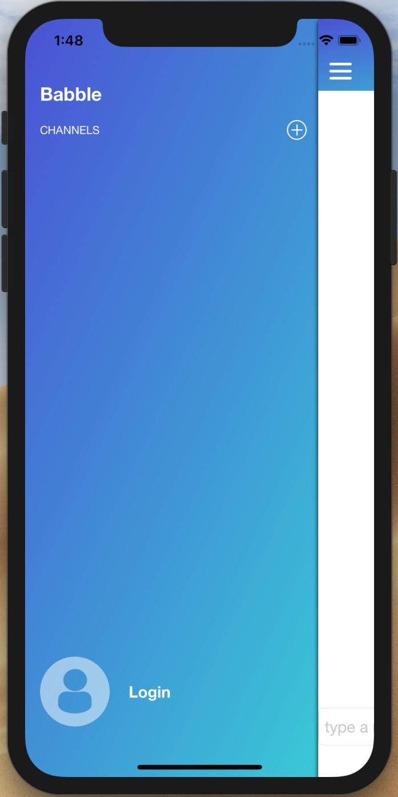
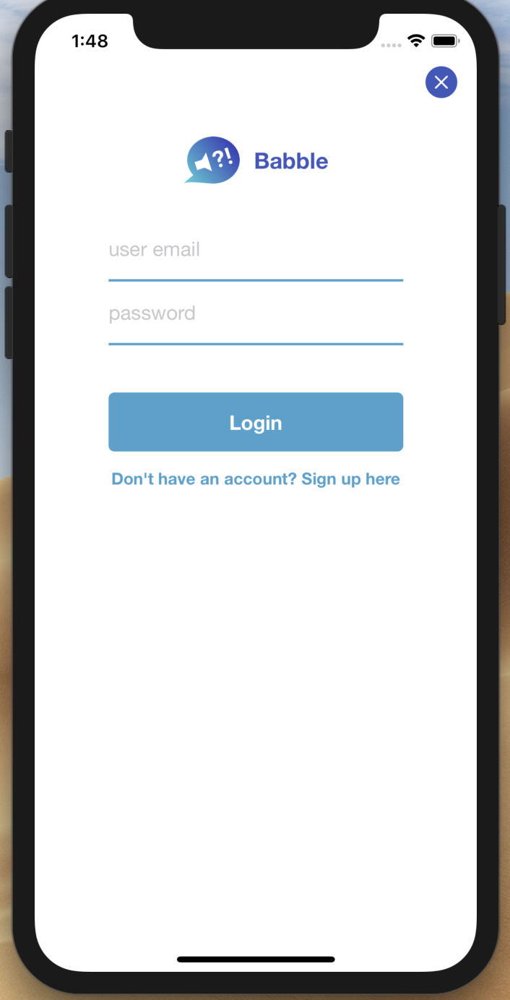
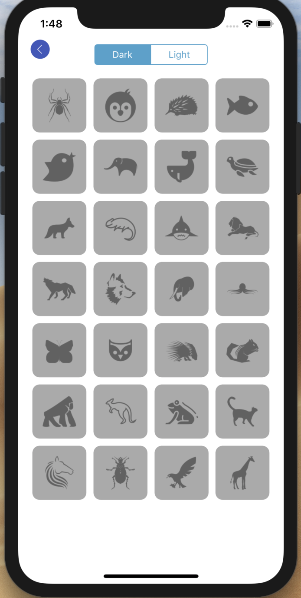
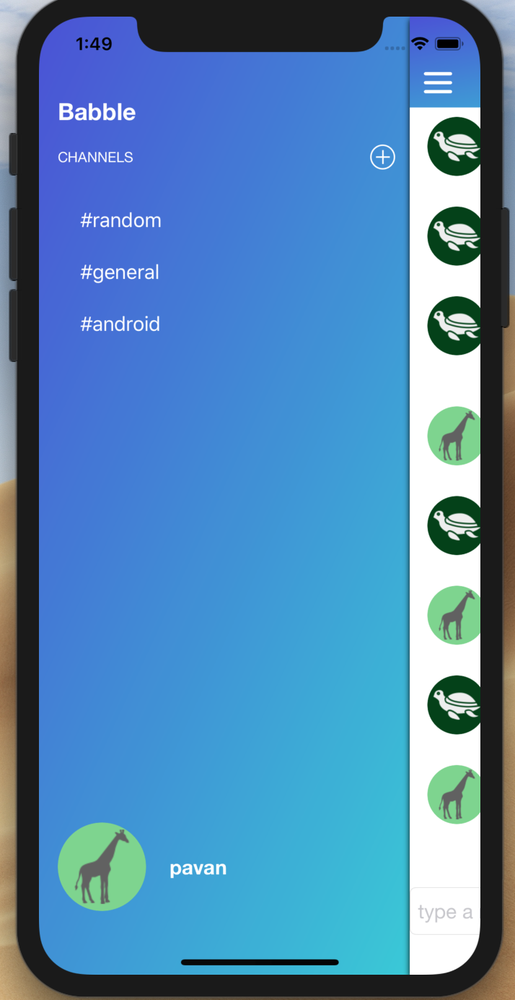
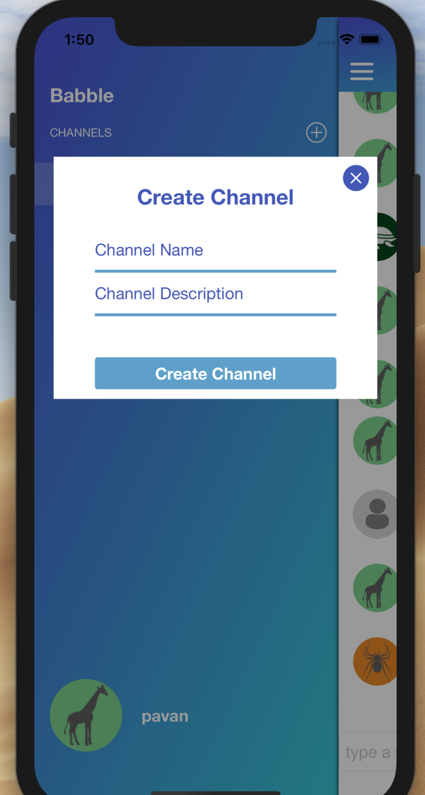
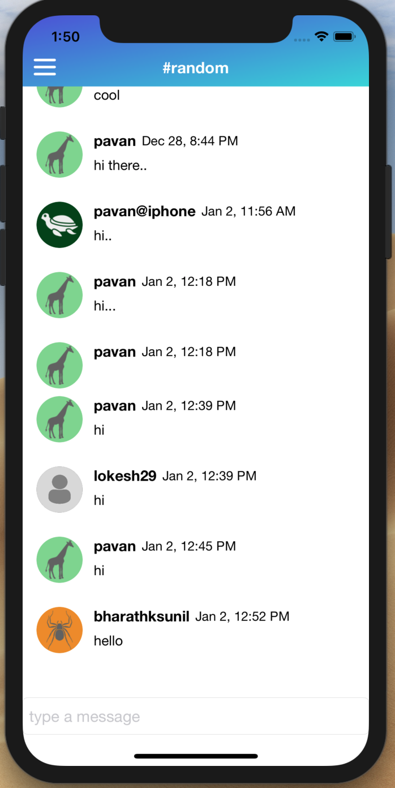
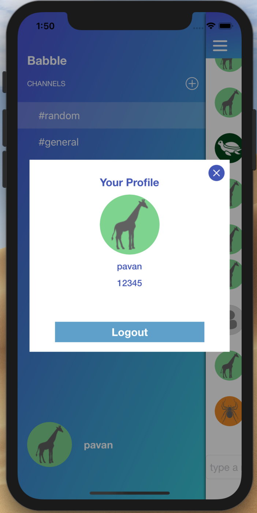

# Babble
<h1>iOS Realtime <b>Slack</b> like chat app.</h1>
<h2>a simple Slack like app with channels and instant messages. 
  backend api is a open source api called <a href="https://github.com/devslopes-learn/mac-chat-api"> mac-chat-api</a>
  hosted in <a href="https://www.heroku.com">Heroku.</a>

 

<table>
 <tr>
   <td>
     <h3>PRE LOGIN</h3>

   </td>
   <td>
     <h3>LOGIN SCREEN</h3>

   </td>
 </tr>
   <tr>
   <td>
     <h3>CREATE ACCOUNT</h3>

   </td>
   <td>
     <h3>POST LOGIN</h3>

   </td>
 </tr>
   <tr>
   <td>
     <h3>CREATE CHANNEL</h3>

   </td>
   <td>
     <h3>MESSAGE SCREEN</h3>

   </td>
 </tr>
   <tr>
   <td>
     <h3>VIEW PROFILE</h3>

   </td>
   <td>
   </td>
 </tr>
</table>

<ul>
  <li>feature to select different channels or create a new channel if required.</li>
  <li>XIB files for profile view and create channels</li>
  <li>feature to send messages in the perticular channel.</li>
  <li>profile view to view user info as well as to logout.</li>
</ul>

